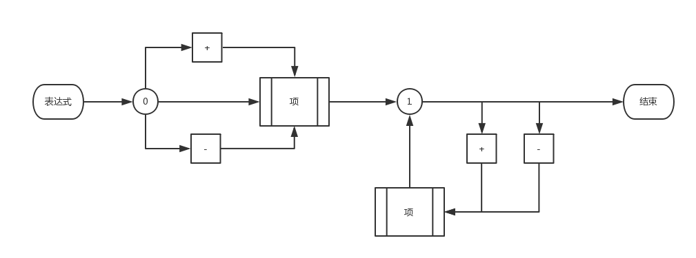
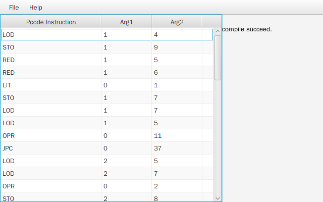

# Compile-Assignment  
#编译原理期末大作业  
github地址：  
https://github.com/TonyBotongChu/Compile-Assignment.git  
作业各版本如有出入，以github代码为准  
本报告的格式参考了  
http://www.cnblogs.com/hf-z/p/5542070.html  
谨在此表示感谢  
##一、设计要求  
###细节要求  
文件输入：符合PL/0文法的源程序（自己要有5个测试用例，包含出错的情况，还要用老师提供的测试用例进行测试）  
输出：P-Code  
错误信息：参见教材第316页表14.4（新书第411页表17.4）。  
错误信息尽量详细（行号，错误类型）  
P-Code指令集：参见教材第351页表15.14。  
语法分析部分要求统一使用递归下降子程序法实现。  
编程语言自定，可使用C、C++、C#或Java等。（尽量选用有可执行文件的）  
上交材料中不但要包括源代码（含注释）和可执行程序，还应有完整文档。  
###加分项  
解释程序  
GUI界面  
##二、PL/0语言的BNF描述  
注意这里的文法与通行的略有不同  
  
<程序> ::= <分程序>.  
<分程序> ::= [<常量说明部分>][变量说明部分>][<过程说明部分>]<语句>  
<常量说明部分> ::= const<常量定义>{,<常量定义>};  
<常量定义> ::= <标识符>=<无符号整数>  
<无符号整数> ::= <数字>{<数字>}  
<标识符> ::= <字母>{<字母>|<数字>}  
<变量说明部分>::= var<标识符>{,<标识符>};  
<过程说明部分> ::= <过程首部><分程序>{<过程说明部分>};  
<过程首部> ::= procedure<标识符>;  
<语句> ::= <赋值语句>|<条件语句>|<当型循环语句>|<过程调用语句>|<读语句>|<写语句>|<复合语句>|<重复语句>|<空>  
<赋值语句> ::= <标识符>:=<表达式>  
<表达式> ::= [+|-]<项>{<加法运算符><项>}  
<项> ::= <因子>{<乘法运算符><因子>}  
<因子> ::= <标识符>|<无符号整数>|'('<表达式>')‘  
<加法运算符> ::= +|-  
<乘法运算符> ::= *|/  
<条件> ::= <表达式><关系运算符><表达式>|odd<表达式>  
<关系运算符> ::= =|<>|<|<=|>|>=  
<条件语句> ::= if<条件>then<语句>[else<语句>]  
<当型循环语句> ::= while<条件>do<语句>  
<过程调用语句> ::= call<标识符>  
<复合语句> ::= begin<语句>{;<语句>}end  
<重复语句> ::= repeat<语句>{;<语句>}until<条件>  
<读语句> ::= read'('<标识符>{,<标识符>}')‘  
<写语句> ::= write'('<标识符>{,<标识符>}')‘  
<字母> ::= a|b|...|X|Y|Z  
<数字> ::= 0|1|2|...|8|9  
##三、目标机的代码  
LIT 0 ，a 取常量a放入数据栈栈顶  
OPR 0 ，a 执行运算，a表示执行某种运算  
LOD L ，a 取变量（相对地址为a，层差为L）放到数据栈的栈顶  
STO L ，a 将数据栈栈顶的内容存入变量（相对地址为a，层次差为L）  
CAL L ，a 调用过程（转子指令）（入口地址为a，层次差为L）  
INT 0 ，a 数据栈栈顶指针增加a  
JMP 0 ，a无条件转移到地址为a的指令  
JPC 0 ，a 条件转移指令，转移到地址为a的指令  
RED L ，a 读数据并存入变量（相对地址为a，层次差为L）  
WRT 0 ，0 将栈顶内容输出  
  
对OPR的特殊说明：  
  
  
a值 | 运算符  
---- | ----  
1 | +  
2 | -  
3 | *  
4 | /  
6 | odd  
8 | =  
9 | <>  
10 | <  
11 | <=  
12 | >  
13 | >=  
  
  
##四、词法分析  
###保留字  
const  
var  
procedure  
begin  
end  
if  
else  
then  
call  
while  
do  
repeat  
until  
read  
write  
###分隔符  
(  
)  
,  
;  
.  
[  
]  
{  
}  
###算数运算符  
\+  
\-  
*  
/  
odd  
###关系运算符  
=  
<  
<=  
\>  
\>=  
<>  
###其他  
数字：词法分析部分可以识别整数和浮点数，但是编译器的其他部分只能处理整数  
标识符：由用户定义，以字母开头，由数字和字母组成  
##五、语法分析和语义分析  
使用递归子程序法，每个方框代表一个子程序；圆形代表status的值（status表示自动机的状态，具体实现见代码中的GrammarAnalyzer类）  
注：旧版教材《编译原理及编译程序构造》第308页的语句图有误，已在此改正）  
  
  
  
  
  
  
##六、程序实现  
本项目采用Java语言实现，共由2个包（PL0analyzer和GUI）组成。这里只列出各文件的作用，具体函数的作用请参看代码中的注释。  
###PL0analyzer  
  
  
文件名 | 作用  
---- | ----  
LexicalAnalyzer.java | 词法分析  
LexicalException.java | 词法分析出现的异常  
Item.java | 词法分析得到的词  
GrammarAnalyzer.java | 语法和语义分析  
GrammarException.java | 语法和语义分析出现的异常  
Symbol.java | 符号表中的符号  
SymbolTable.java | 符号表  
Pcode.java | P-code指令（包括参数）  
PVM.java | 目标机（只有数据结构，具体功能暂未实现）  
  
###GUI  
  
  
文件名 | 作用  
---- | ----  
MainConsole.java | 原Console版的Main类，删去了Main函数  
Main.java | GUi版的Main类  
RootLayout.fxml | 图形界面的布局文件  
RootLayoutController.java | 图形界面的消息处理  
  
##七、运行截图  
本项目在Ubuntu 16.04和Windows 10下测试通过。为保证程序正常运行，请使用Java 8作为运行环境。  
  
##八、其他  
本报告以CC BY-SA 3.0授权协议发布。项目代码以GPL v3协议发布。  
  
除教材外，本项目编写过程中参考过的资料有：  
https://github.com/justinzhf/PL-0-Compiler  
http://jcf94.com/2016/02/21/2016-02-21-pl0/  
https://www.freemindworld.com/blog/2002/020815_pl0_analysis.shtml  
在此一并表示感谢  
  
2017年12月31日  
zbt 保留部分权利  
